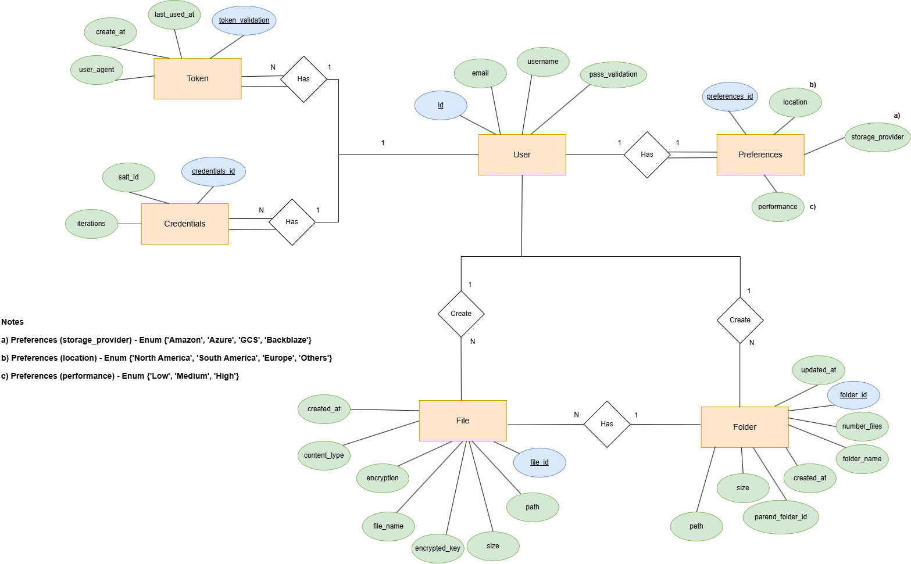

#  Multi Cloud Guardian - Backend Documentation

> This is the backend documentation for the Multi Cloud Guardian.

## Table of Contents

- [Introduction](#introduction)
- [Modeling the Database](#modeling-the-database)
  - [Conceptual Model](#conceptual-model)
  - [Key Relationships](#key-relationships)
  - [Physical Model](#physical-model)
- [Application Architecture](#application-architecture)
- [Presentation Layer](#presentation-layer)
- [Service Layer](#service-layer)
- [Data Access Layer](#data-access-layer)
- [Data Representation](#data-representation)
- [Validation](#validation)
- [Concurrency](#concurrency)
- [Error Handling](#error-handling)

---

## Introduction

The backend server is a RESTful API that provides the functionality for
the Multi Cloud Guardian.
It is written mainly in Kotlin in a JVM gradle project.

The JVM application is a Spring Boot application, built with [Spring Initializer](https://start.spring.io/).

Some dependencies used in this project are:

- **[Spring Web](https://spring.io/projects/spring-framework)** - for the REST API;
- **[Jdbi](https://jdbi.org/)** - for the database access, using [PostgreSQL](https://www.postgresql.org/) as the
  database;
- **[Docker Compose](https://docs.docker.com/compose/)** - for the deployment of the application.

---

## Modeling the Database

### Conceptual Model

The following diagram holds the Extended Entity-Relationship (EER) model for the information managed by the system.

|  |
| :------------------------------------------------------------------: |
|                _Extended Entity relationship diagram_                |

We highlight the following aspects:

The conceptual model has the following restrictions:

- `User` entity:

  - The `username` and `email` attributes should be unique;
  - The `username` attribute length should be 5–25 characters long;
  - The `email` attribute needs to follow the following regex pattern: `^[a-zA-Z0-9._-]+@[a-zA-Z0-9.-]+$`.
  - The `pass_validation` attribute represents the hashed password

- `Token` entity:

  - The `created_at` and `last_used_at` attributes represent the seconds since the [Unix epoch](https://en.wikipedia.org/wiki/Unix_time), and should be greater than 0;
  - The `last_used_at` attribute should be greater than or equal to the `created_at` attribute.
  - The `user_agent` attribute stores the user agent string, identifying the client software (e.g., device) that generated the token.

- `Credentials` entity:

  - The `iterations` attribute should be between 15,000 and 20,000;
  - The `salt` attribute stores a random value used in the password hashing process with PBKDF2;

- `Preferences` entity:

  - The `location` attribute only accepts values: `0` (North America), `1` (South America), `2` (Europe), `3` (Others);
  - The `cost` attribute only accepts values: `0` (Low), `1` (Medium), `2` (High);
  - The `storage_provider` attribute only accepts values: `0` (Amazon), `1` (Azure), `2` (Google Cloud Storage), `3` (Backblaze);
  - Each user has exactly one set of preferences (1:1 relationship).

- `Folder` entity:

  - The `folder_name` attribute must be between 2 and 25 characters long;
  - The `created_at` and `updated_at` attributes represent the number of seconds since the [Unix epoch](https://en.wikipedia.org/wiki/Unix_time), and must be greater than 0;
  - The `updated_at` attribute must be greater than or equal to the `created_at` attribute;
  - The `size` and `number_files` attributes are automatically updated by database triggers;
  - Folders can form a hierarchical structure via the `parent_folder_id` self-referencing relationship;
  - The `path` attribute stores the path associated with the folder on the cloud storage provider.

- `File` entity:
  - The `file_name` and `file_fake_name` attribute stores the name of the file;
  - The `size` attribute represents the file size in bytes;
  - The `created_at` attribute represents the number of seconds since the [Unix epoch](https://en.wikipedia.org/wiki/Unix_time), and must be greater than 0;
  - The `encryption` attribute is a boolean that indicates whether the file is encrypted;
  - When `encryption` is `true`, the `encrypted_key` attribute stores a representation of the File Key used to decrypt the file content.
  - The `content_type` attribute stores the MIME type of the file (e.g., `image/png`, `application/pdf`);
  - The `path` attribute stores the full storage path of the file on the cloud provider, associated with its folder;
  - Files are automatically categorized in the `user_file_storage_summary` view into one of the following types, based on their `content_type`: Images, Video, Documents, or Others.

- `Join_Folders` entity:
  - This junction entity manages user access to shared folders.
    - Composite primary key of user_id (foreign key to Users) and folder_id (foreign key to Folders), both with cascade on delete and update. 
    - Triggers insert owners or new members into this table for shared folders. 
    - Deleting from this table triggers removal of previous invitations and user files from the shared folder.

### Key Relationships

- Users can have multiple tokens;
- Each user has exactly one set of credentials and preferences;
- Users can create multiple files and folders;
- Files can optionally belong to folders;
- Folders can contain other folders in a hierarchical structure;
- Folder statistics (`size` and `file count`) are automatically updated when files are added, modified, or deleted.

### Physical Model

The physical model of the database is available in [create-schema.sql](../src/sql/create-schema.sql).

To implement and manage the database [PostgreSQL](https://www.postgresql.org/) was used.

The [code/jvm/src/sql](../src/sql) folder contains all SQL scripts developed:

- [create-schema.sql](../src/sql/create-schema.sql) - creates the database schema;
- [insert-data.sql](../src/sql/insert-test-data.sql) - adds test data to the database;

We highlight the following aspects of this model:

- **Uniqueness of identifying attributes**: In this database model, attributes that are not primary keys but uniquely
  identify an entity have been marked as unique. This ensures that these attributes maintain their uniqueness throughout
  the data, contributing to data integrity.

- **Using epoch seconds for timestamps**: The decision to use epoch seconds for the `created_at` and `updated_at`
  attributes
  was made for efficiency and simplicity. Epoch seconds are easy to work with and are more efficient to store and
  retrieve than other formats.

### Application Architecture

|  |
|:---------------------------------------------:|
|      _Application architecture diagram_       |

The JVM application is organized as follows:

- [/domain](../multicloud-guardian/domain/src/main/kotlin/pt/isel/leic/multicloudguardian/domain) - contains the domain classes
  of the application ensure data integrity throughout the application;
- [/http](../multicloud-guardian/http/src/main/kotlin/pt/isel/leic/multicloudguardian/http) - contains the HTTP layer of the application. This layer
  is responsible for handling the HTTP requests and generating the responses, orchestrating the service layer;
- [/repository](../multicloud-guardian/repository/src/main/kotlin/pt/isel/leic/multicloudguardian/repository) - contains the repository layer of
  the application, which provides implementations that can access the database;
- [/services](../multicloud-guardian/services/src/main/kotlin/pt/isel/leic/multicloudguardian/service) - contains the services that manage the
  business logic of the application and orchestrate the repository layer;
- [/utils](../multicloud-guardian/domain/src/main//kotlin/pt/isel/leic/multicloudguardian/domain/utils) - contains utility classes used by the
  application in all layers, such as the `Either` class which serves as an abstract representation of an
  operation result (either a success or a failure);
- [MultiCloudGuardian.kt](../multicloud-guardian/host/src/main/kotlin/pt/isel/leic/multicloudguardian/MultiCloudGuardianApplication.kt) - contains the spring boot class
  configuration and
  the entry point of the application.

### [Presentation Layer](../multicloud-guardian/http/src/main/kotlin/pt/isel/leic/multicloudguardian/http/)

The presentation layer is responsible for receiving the requests from the client,
processing them in a way the service layer is expecting,
sending them and returning the responses to the client, using the appropriate
media type.

To represent the data in the requests, several models were created:

- **input models** - used to represent the data in the requests.
- **output models** - used to represent the data in the responses.

This layer is implemented using Spring Web MVC and Spring Validation for input models.

The presentation layer is organized as follows:

- [/controllers](../multicloud-guardian/http/src/main/kotlin/pt/isel/leic/multicloudguardian/http/controllers) - contains the controllers that handle the HTTP requests
  and generate the responses;
- [/media](../multicloud-guardian/http/src/main/kotlin/pt/isel/leic/multicloudguardian/http/media) - contains the classes that represent the media types used in the
  application such as `application/problem+json`;
- [/pipeline](../multicloud-guardian/http/src/main/kotlin/pt/isel/leic/multicloudguardian/http/pipeline/) - contains all filters, interceptors, argument resolvers and
  request
  processors used by the application before and after the request is handled by the controllers;
- [CustomExceptionHandler](../multicloud-guardian/http/src/main/kotlin/pt/isel/leic/multicloudguardian/http/util/CustomExceptionHandler.kt) - contains exception handlers
  that generate the responses for the exceptions thrown by the application;
- [Uris](../multicloud-guardian/http/src/main/kotlin/pt/isel/leic/multicloudguardian/http/Uris.kt) - object that contains the URIs of the application used by the
  controllers;

### [Service Layer](../multicloud-guardian/services/src/main/kotlin/pt/isel/leic/multicloudguardian/service)

The service layer is responsible for managing the business logic of the application, receiving the requests from the
presentation layer, processing them, sending them to the data access layer and returning the responses to the
presentation layer.

To represent the result of a service operation, the [Either](../multicloud-guardian/domain/src/main/kotlin/pt/isel/leic/multicloudguardian/domain/utils/Either.kt) class
was created.
This class ensures both the success and failure cases are always represented, which then allows the presentation layer
to generate the appropriate response based on the result of the service operation.

Each service provided by the application does not have an interface because it is not expected to have multiple
implementations of the same service.
In a service, a [TransactionManager](../multicloud-guardian/repository/src/main/kotlin/pt/isel/leic/multicloudguardian/repository/TransactionManager.kt) is received
as a constructor dependency, which then allows the service to manage the transaction scope of the service operation and
the underlying data access.

The service layer is organized as follows:

- [UsersService](../multicloud-guardian/services/src/main/kotlin/pt/isel/leic/multicloudguardian/service/user/UsersService.kt) - manages the requests related to the users;
- [StorageService](../multicloud-guardian/services/src/main/kotlin/pt/isel/leic/multicloudguardian/service/storage/StorageService.kt) - manages the requests related to the storage;

Associated with each service package, there are one or more classes that represent the result of the service operation.
Some are defined as typealiases to improve readability.

### [Data Access Layer](../multicloud-guardian/repository/src/main/kotlin/pt/isel/leic/multicloudguardian/repository)

The data access layer is responsible for interacting with the database to persist and retrieve the data.

An interface was created for each entity of the application, which then has an implementation that uses JDBI fluent
api to interact with the database.
Only domain classes can be used in the operations of the data access layer as parameters or return types.

The data access layer is organized as follows:

- [/jdbi](../multicloud-guardian/repository-jdbi/src/main/kotlin/pt/isel/leic/multicloudguardian/repository/jdbi) - contains the configuration, repository and transaction
  implementations,
  mappers and models that work with Jdbi directly;
- [/transaction](../multicloud-guardian/repository-jdbi/src/main/kotlin/pt/isel/leic/multicloudguardian/repository/jdbi/JdbiTransaction.kt) - contains the transaction abstractions used by the
  service layer to manage the transaction scope of the service operation;
- [UsersRepository](../multicloud-guardian/repository-jdbi/src/main/kotlin/pt/isel/leic/multicloudguardian/repository/jdbi/JdbiUsersRepository.kt) - exposes the operations related to the
  users;
- [StorageRepository](../multicloud-guardian/repository-jdbi/src/main/kotlin/pt/isel/leic/multicloudguardian/repository/jdbi/JdbiStorageRepository.kt) - exposes the operations related to the
  storage;

### Data Representation

The application uses multiple types of data representations to separate concerns across different layers:

- **JSON Models** – Represent the JSON structure exchanged over HTTP:

  - **Input Models** – Used to represent data received in HTTP requests;
  - **Output Models** – Used to represent data returned in HTTP responses;

- **Domain Classes** – Represent the internal data structures used in the application's business logic;

- **PageResult** – Used to encapsulate paginated lists of content in HTTP responses.

To facilitate the transformation between domain classes and JSON models, dedicated interfaces and utilities were created. Notably:

- [`JsonModel`](../multicloud-guardian/http/src/main/kotlin/pt/isel/leic/multicloudguardian/http/model/) – Responsible for converting domain classes into output models;

- [`PageResult`](../multicloud-guardian/domain/src/main/kotlin/pt/isel/leic/multicloudguardian/domain/utils/PageResult.kt) – Used to wrap paginated results with metadata such as page number, total elements, and sorting options.

#### Example of a paginated response:

```json
{
  "content": [
    {
      "fileId": 1,
      "user": {
        "id": 2,
        "username": "TestIsel",
        "email": "testisel@gmail.com"
      },
      "folderId": null,
      "name": "TestAzure.jpg",
      "size": 122667,
      "contentType": "image/jpeg",
      "createdAt": 1748865202,
      "encryption": false,
      "url": null
    },
    {
      "fileId": 2,
      "user": {
        "id": 2,
        "username": "TestIsel",
        "email": "testeisel@gmail.com"
      },
      "folderId": null,
      "name": "TestAzureEncry.jpg",
      "size": 122716,
      "contentType": "image/jpeg",
      "createdAt": 1748865224,
      "encryption": true,
      "url": null
    }
  ],
  "pageable": {
    "sort": {
      "sorted": true,
      "unsorted": false
    },
    "pageNumber": 0,
    "pageSize": 10,
    "offset": 0
  },
  "totalElements": 2,
  "totalPages": 1,
  "last": true,
  "first": true,
  "size": 10,
  "number": 0
}
```

### Validation

In the backend infrastructure, data validation is enforced at two distinct layers to ensure both correctness of incoming data and consistency of persisted data:

- **Spring Validation (Application Layer)**:  
  Spring’s validation framework is used to validate incoming HTTP request data, such as request bodies, path variables, and query parameters.  
  This is achieved through annotations provided by the `jakarta.validation` API, applied directly to input model fields.

  Example:

  ```kotlin
  data class UserCreateInputModel(
    @field:NotBlank(message = "Username must not be blank")
    @field:Size(
        min = Username.MIN_LENGTH,
        max = Username.MAX_LENGTH,
        message = "Username must have between ${Username.MIN_LENGTH} and ${Username.MAX_LENGTH} characters",
    )
    @field:Pattern(
        regexp = "^[a-zA-Z0-9._-]+$",
        message = "Username can only contain letters, numbers, '.', '-' and '_'",
    )
    val username: String,
    @field:NotBlank(message = "Email must not be blank")
    @field:jakarta.validation.constraints.Email(message = "Email must be valid")
    val email: String,
    @field:NotBlank(message = "Password must not be blank")
    @field:Size(
        min = Password.MIN_LENGTH,
        max = Password.MAX_LENGTH,
        message = "Password must have between 5 and 40 characters",
    )
    val password: String,
    @field:NotBlank(message = "Salt must not be blank")
    val salt: String,
    @field:NotNull(message = "Iterations must not be null")
    val iterations: Int,
    val costType: CostType,
    val locationType: LocationType,
  ) 
  


  // In the controller handler method, the request body is
  // validated by Spring when @Valid is used.
  @PostMapping(Uris.Users.CREATE)
    fun createUser(
        @Validated @RequestBody input: UserCreateInputModel,
    ): ResponseEntity<*> {
      // (...)
  }
  ```

- **Database**: The database enforces data integrity and business rules through constraints defined in the schema.
  These include primary keys, foreign keys, unique constraints, and check constraints.
  This layer ensures that even if data bypasses the application logic, it still adheres to structural and referential integrity rules.

### Concurrency

To ensure the application's thread safety and data consistency, several measures have been implemented:

- **Database Transactions**: Database transactions are employed to maintain data consistency and ensure that operations
  are atomic. This means that a series of database operations either all succeed or all fail, preventing data corruption
  or inconsistencies.

- **Immutable Objects**: The domain classes are designed as immutable objects. Once these objects are created, they
  cannot be modified. This immutability guarantees data consistency and helps maintain atomic operations.

- **Isolation Levels**: The database transactions are configured to use the `SERIALIZABLE` isolation level, which
  ensures that the transactions are executed in a way that is indistinguishable from serial execution. This means that
  the transactions are executed one after the other, preventing concurrency problems such as dirty reads, non-repeatable
  reads and phantom reads.

These measures collectively contribute to the application's thread safety and data integrity, ensuring that operations
are executed consistently and in a reliable way.

### Error Handling

To handle errors/exceptions, we implemented
the [CustomExceptionHandler](../multicloud-guardian/http/src/main/kotlin/pt/isel/leic/multicloudguardian/http/util/CustomExceptionHandler.kt) class, which is annotated
with `@ControllerAdvice`, and is responsible for intercepting the harder to detect errors that occur in the
application and generating the appropriate response.

As mentioned before, the [Either](../multicloud-guardian/domain/src/main/kotlin/pt/isel/leic/multicloudguardian/domain/utils/Either.kt) class is used to
represent the result of a service operation.
Which then the presentation layer can generate the appropriate response
based on the result type of the service.

Example:

```kotlin
// service returns:
Either<UserCreationError, Id>

// controller receives the result and evaluates it:
return when (result) {
    // Success
    is Either.Right -> ResponseEntity.status(HttpStatus.CREATED).body(result.value)
    // Failure
    is Either.Left -> when (result.value) {
        is UserCreationError.UserNameAlreadyExists -> Problem(
            type = "https://example.com/docs/user-already-exists",
            title = "UserName already exists",
            status = 400,
            detail = "Give username ${username.value} already exists",
            instance = "https://example.com/users"
        ).toResponse()
        // (...) other errors
    }
}
```

To represent an error in the presentation layer, the media type chosen was `application/problem+json`, which is a
standard
media type for
representing errors in HTTP APIs.
The [RFC 7807](https://tools.ietf.org/html/rfc7807) defines the standard for this media type.

It consists of:

- **type** - a URI reference that identifies the problem type;
- **title** - a short, human-readable summary of the problem type;
- **status** - the HTTP status code generated by the origin server for this occurrence of the problem;
- **detail** - a human-readable explanation specific to this occurrence of the problem;
- **instance** - a URI reference that identifies the specific occurrence of the problem;
